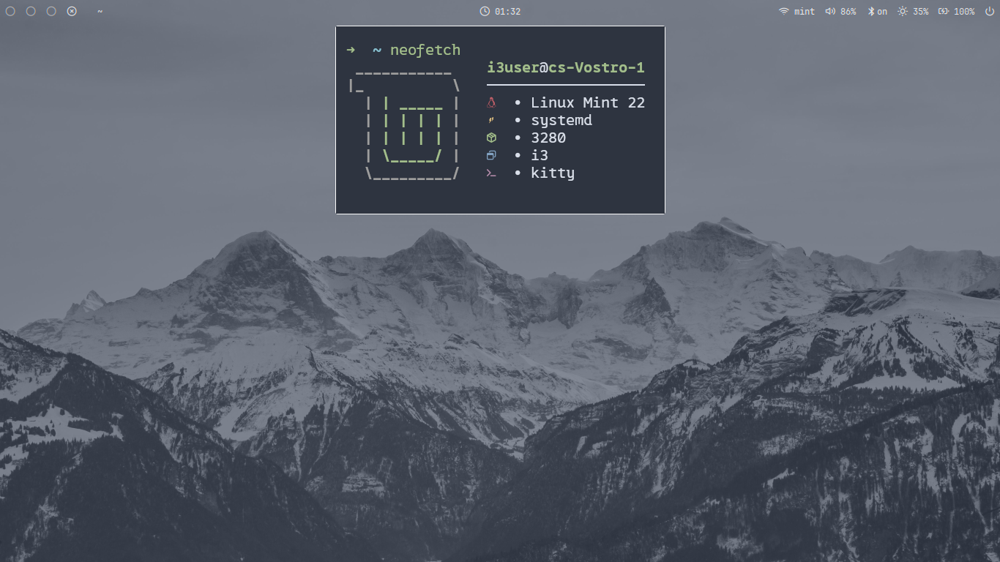

# I3 Nord Theme Installation Guide for Linux Mint [WIP TUTORIAL]



## Prerequisites

This is made for mint users who really like playing around with theming and editing .config files, do note that you can get all of this already shipped with cinnamon and run a polybar along with a few hotkeys (the only thing you're losing is tiling) , though you can daily drive with this.

Before installing, please back up your data with timeshift, and double check what you're copyingg.

## Required Packages
Run the following command to install essential packages:

```bash
sudo apt update && sudo apt install -y \
    i3 \
    picom \
    polybar \
    rofi \
    dunst \
    kitty \
    feh \
    qt5ct \
    zsh \
    neovim \
    lxappearance \
    fonts-jetbrains-mono 
```

## Optional but Recommended Packages
```bash
sudo apt install -y \
    eza \
    lazygit \
    gdb
```

## Font Installation
Ensure you have Nerd Fonts installed. Specifically:
- 0xProto Nerd Font
- JetBrains Mono Nerd Font
- Run `installfont.sh`(make sure to `chmod +x installfonts.sh` first)

## OH MY ZSH (Required)
Needed for some plugins to work.
```bash
sh -c "$(curl -fsSL https://raw.githubusercontent.com/ohmyzsh/ohmyzsh/master/tools/install.sh)"
```

## Configuration Steps
1. Git Clone my dotfiles then copy the `.config` to `.config`

1.2. Copy the others (`.themes`,`.icons`,`.fonts`) to ~.

1.3. Manually edit the nord theme using lxappearance and qt5tc to get nord theme gtk and icons+qt5 apps) (tho u might not need to, just check if u can though)


2. Make scripts executable:
   ```bash
   chmod +x ~/.config/i3/scripts/*.sh
   chmod +x ~/.config/polybar/scripts/*.sh
   ```

3. Install Spicetify (optional, for Spotify theming, i recommend also getting the marketplace and getting spotifytui as it comes with nord pallete):
   ```bash
   curl -sS https://raw.githubusercontent.com/spicetify/spicetify-cli/master/install.sh | sh
   ```

## Post-Installation
1. Restart your system or log out and log back in.
2. Use `Super + Shift + r` to restart i3 window manager.
3. Use `Super + /` for the cheatsheet

## Customization Notes
- Modify `~/.config/rofi/config.rasi` for Rofi appearance
- Adjust Polybar modules in `~/.config/polybar/modules.ini`
- Customize Kitty terminal in `~/.config/kitty/kitty.conf`

## Troubleshooting
- If transparency or compositor issues occur, check `~/.config/picom/picom.conf`
- For audio/bluetooth problems, ensure PulseAudio and Bluetooth services are running
- If you still feel lost, don't be afraid to use claude.ai, it honestly helped me alot in my theming journey.
